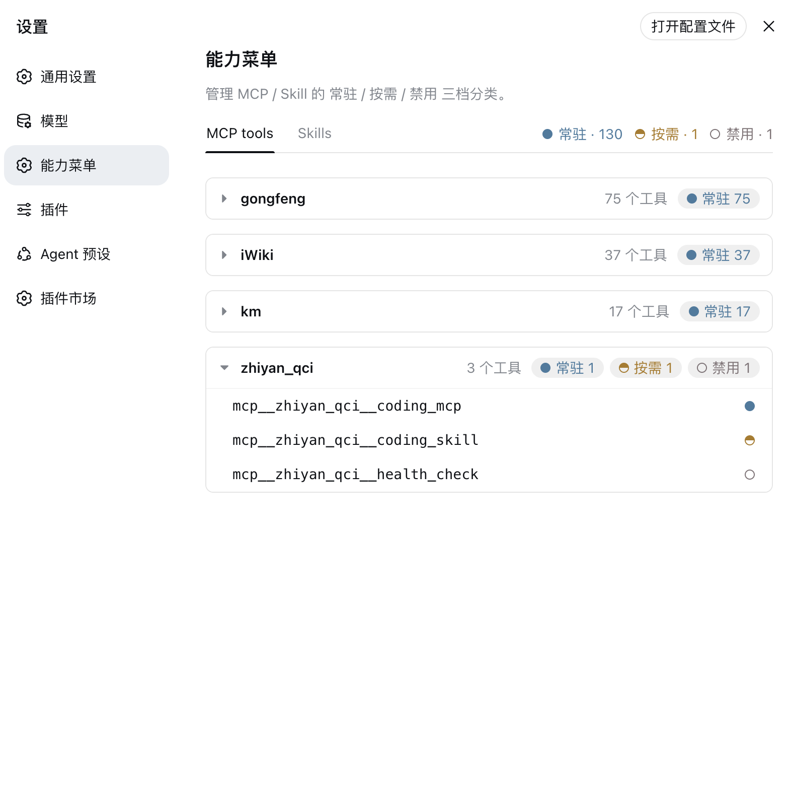
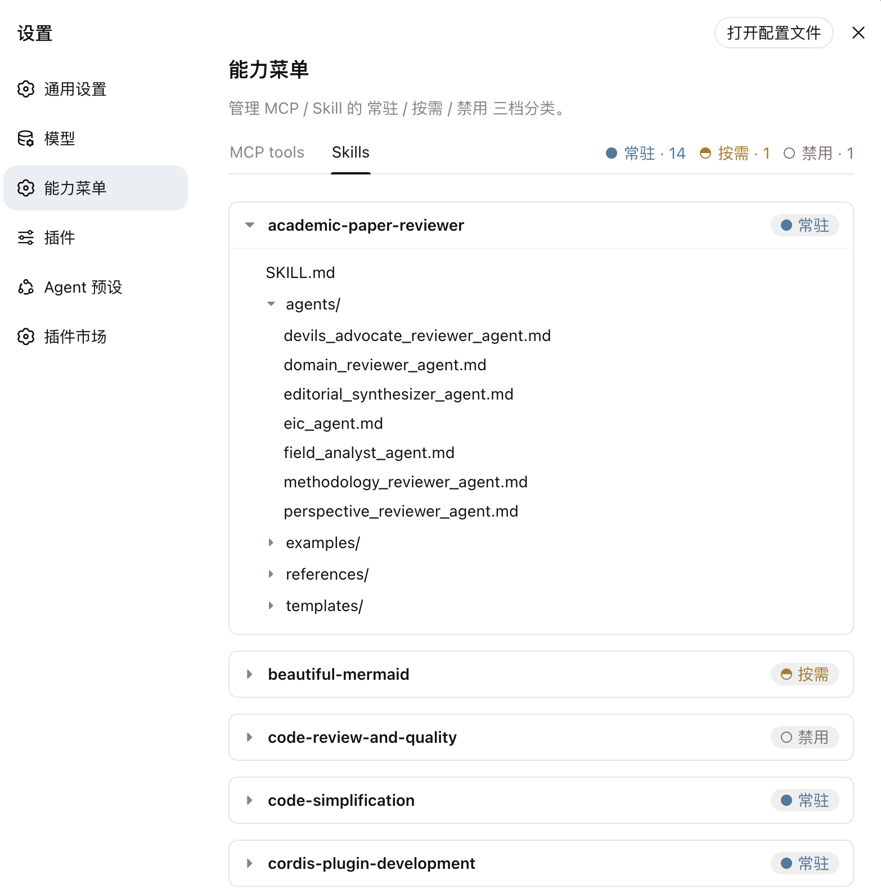

<h1 align="center">dsh-capability-menu</h1>

<p align="center">
  <strong>One unified capability menu for DeepSeek Harness: manage the exposure level (context footprint) and execution of Tools and Skills</strong>
</p>

<p align="center">
  <a href="https://www.npmjs.com/package/@daweifu/capability-menu"></a>
  <a href="https://www.npmjs.com/package/@daweifu/capability-menu"></a>
  <a href="./LICENSE"></a>
  <a href="https://github.com/PKUfudawei/dsh-capability-menu"></a>
  <a href="https://github.com/deepseek-ai/deepseek-harness"></a>
  <a href="https://github.com/PKUfudawei/dsh-capability-menu/actions"></a>
</p>

<p align="center">
  <a href="./README.md">简体中文</a> · <strong>English</strong>
</p>

<br/>

## Table of Contents

- [Capability Overview](#capability-overview)
- [Quick Install](#quick-install)
- [Exposure Policy](#exposure-policy)
- [Configuration](#configuration)

---

## Capability Overview

dsh-capability-menu is a Cordis plugin for [DeepSeek Harness](https://github.com/deepseek-ai/deepseek-harness). It builds a unified capability catalog (`ctx.capability`) over a large number of MCP tools / skills and manages their **exposure level and execution** in three tiers — **Resident / On-demand / Blocked** — so you can adjust the agent's capability boundary at any time, keep a flood of tools/skills out of a single request, and save tokens and context. Changes apply immediately without restarting, and the plugin composes into the Harness runtime purely through the Cordis plugin mechanism — no upstream source is modified.

### Capability Model

*Capability* is the umbrella concept introduced by this plugin: a Tool and a Skill are different *kinds* of capability.

| kind | provides to the agent | action | notes |
| --- | --- | --- | --- |
| `tool` | executes an action (an MCP tool) | `execute` | indexed by `ctx.tools` |
| `skill` | the method / flow / knowledge for a class of tasks | `load` | indexed by `ctx.skills` |

The model gets two meta tools:

| tool | role | corresponding entry |
| --- | --- | --- |
| `meta_search` | search the capability catalog (Tool / Skill), list/detail dual mode | `@daweifu/capability-menu/search` |
| `meta_invoke` | unified execution surface: really executes Tools (full `ctx.tools` pipeline) + loads Skills | `@daweifu/capability-menu/invoke` |

### Capability Menu

<p align="center">
  
  
</p>

Once installed, a Capability Menu tab appears under Settings → General Settings (between "Model" and "Plugins"). It lets you visualize and adjust the exposure policy; changes apply immediately, no restart needed:

- **Two panes**: MCP tools (grouped by server, collapsible) and Skills.
- **Three-state dot + statistics**: every capability carries a classification dot — solid = Resident, half-filled = On-demand, hollow = Blocked — and per-class counts are shown at the top of the pane.
- **Click to cycle**: click a capability's dot or a class count to cycle its classification; if a higher-priority rule (e.g. a wildcard) overrides it, the UI reports that the classification did not apply; clicking an MCP tool row shows its model-facing tool definition (name / description / parameters).
- **Skill directory browsing**: expand a skill to browse its file tree; click a file to preview the content, e.g. its SKILL.md.

## Quick Install

Prerequisites: Node.js and the dsh CLI installed (`dsh plugin` forwards to pnpm internally).

### Install from npm (recommended)

A single package ships both the server-side plugin and the front-end Capability Menu tab; once installed it shows up under Settings → General Settings:

```sh
dsh plugin --profile web add @daweifu/capability-menu
```

### Install from source

```sh
git clone https://github.com/PKUfudawei/dsh-capability-menu.git
cd dsh-capability-menu
pnpm install                   # the prepare script builds lib/ (server) and lib/client.js (front-end)

dsh plugin --profile web add ./dsh-capability-menu
```

### Verify the install

```sh
dsh --profile web --dump-config | grep -E 'capability-menu'
```

```
# == @daweifu/capability-menu
- id: capability-menu-registry
  name: '@daweifu/capability-menu/registry'
- id: capability-menu-search
  name: '@daweifu/capability-menu/search'
- id: capability-menu-invoke
  name: '@daweifu/capability-menu/invoke'
- id: capability-menu-policy
  name: '@daweifu/capability-menu/policy'
- id: capability-menu
  name: '@daweifu/capability-menu'
```

### Uninstall

```sh
dsh plugin --profile web remove @daweifu/capability-menu
```

## Exposure Policy

All capabilities (Tool and Skill) fall into three tiers by their **exposure level** (what the model sees in the context) and their **execution mode**:

### Tools / Skills three-tier exposure and execution

| tier | capability | exposure (model view) | discovery | execution |
| --- | --- | --- | --- | --- |
| **Resident** | tool | full schema in `assembly.tools` → the model's `tools` request payload, visible at every step | none (already resident) | model calls it directly; at runtime it goes through the full `ctx.tools` pipeline |
| | skill | name + description in the `<available_skills>` catalog (body not in the catalog) | none (already resident) | the `skill` tool loads the body on demand (progressive loading) |
| **On-demand** | tool | not in the payload (zero context cost) | `meta_search` list / `grep` the materialized catalog YAML (`catalogFile`) | executed by `meta_invoke` (via `ctx.tools.execute`, full pipeline); or fetch the schema through detail and call it directly |
| | skill | not in the `<available_skills>` catalog | `meta_search`, or `grep` the materialized catalog YAML (`catalogFile`; entries come from `progressiveSkillCatalog` and registered skills) | `meta_invoke` loads the SKILL.md body by `path` |
| **Blocked** | tool | not in the payload | not returned by `meta_search`, not written to the catalog YAML | refused by `meta_invoke`; hallucinated direct calls are also hard-rejected in `tools/pre-execute` |
| | skill | not in the `<available_skills>` catalog | not returned by `meta_search`, not written to the catalog YAML | refused by `meta_invoke`; the `skill` tool is hard-rejected in `tools/pre-execute` |

> The tool tiers in the table above all refer to `mcp__` cataloged tools. Native tools do not take part in three-tier management; they can only be kept visible through `tools.exposed` (see the configuration sample below).

## Configuration

Rules are declared under the `config` of the `capability-menu-policy` plugin entry in the profile's `cordis.patch.yml` (the outer `- insert:` / `id` / `name` is Cordis patch boilerplate and has nothing to do with the rules):

```yaml
config:
  tools:
    exposed: [execute_cmd, get_session_context, search_kb, 'mcp__gongfeng__*']   # wildcard: everything under this server is resident
    progressive: ['mcp__*', 'server:km:*']                                        # wildcard fallback + bulk on-demand by server prefix
    blocked: ['mcp__secret__*']                                                   # blocked outranks everything, even resident
  skills:
    exposed: [debugging, coding]
    progressive: [legacy_skill]          # explicit on-demand (unlisted skills default to resident)
    blocked: [forbidden_skill]
  metaTools: [meta_search, meta_invoke]  # always resident; cannot be blocked
  progressiveSkillCatalog: ~/.dsh/progressive-skills.yaml
```

**Rule priority** (first match wins): `blocked` exact > `blocked` wildcard > `exposed` exact > `progressive` exact > `exposed` wildcard > `progressive` wildcard > default Exposed. `blocked` is the hardest control (it overrides everything), and the meta tools (`meta_search`/`meta_invoke`) are always Exposed and cannot be blocked. **Exact rules win over wildcards (even across tiers)**: for example, when `tools.exposed: ['mcp__gongfeng__*']` exists, clicking a tool to On-demand in the Capability Menu writes an exact `progressive` rule that takes effect properly instead of being pushed back by the wildcard (if it is still overridden by a higher-priority rule, the UI reports that the classification did not apply). Listing native tools in `tools.exposed` (such as `execute_cmd`) *keeps them alive*: native tools are not part of the capability catalog and are only clipped in visibility by the projection chain — listing them here keeps them visible and callable by the model. Once overridden by progressive/blocked, the model can neither see nor call them.

> Changes made in the Capability Menu tab only write to in-memory runtime state and are not persisted. To persist them (apply with the profile, version-controllable / batch-declarable), edit the profile's `cordis.patch.yml` — that is the persistence entry point; no extra import/export buttons are needed.

### Progressive skill catalog (`progressiveSkillCatalog`)

On-demand (Progressive) skills stay out of the fixed context and may not even be registered in `ctx.skills`. To keep them discoverable, a separate YAML stores name + description + path, indexed by the registry and searched via `meta_search`; the full SKILL.md is loaded on demand by `meta_invoke` (reading the YAML `path` when the skill is not registered in `ctx.skills`):

```yaml
# ~/.dsh/progressive-skills.yaml
skills:
  - name: legacy_skill            # matches the rule name in skills.progressive
    description: A legacy migration skill, used infrequently
    whenToUse: Use when working on legacy projects
    path: /path/to/legacy_skill   # directory containing SKILL.md
```

### On-demand capability catalog (`catalogFile`, searchable with `grep`)

On-demand (Progressive) capabilities are materialized into a YAML catalog file — the registry rewrites it automatically whenever tools/skills change or classification changes (a Capability Menu click or `updateConfig`). It defaults to `~/.dsh/capability-catalog.yaml` (change it with `catalogFile`, or disable by setting an empty string). This lets the model search on-demand capabilities directly with the native `grep`/`read`, without having to "think of" calling `meta_search` first; `meta_search` is still available as the structured schema entry point. The system prompt always carries one line pointing at the catalog path, telling the model to `grep` it first when it needs a low-frequency capability (when there are no on-demand capabilities at all, no line is injected, saving context).

```yaml
# ~/.dsh/capability-catalog.yaml (auto-generated; contains only Progressive
# capabilities — Exposed ones are already resident and Blocked ones must not
# be discoverable, so neither is written)
capabilities:
  - id: mcp__km__search
    kind: tool
    name: mcp__km__search
    description: Search the knowledge base
    server: km
  - id: skill:legacy_skill
    kind: skill
    name: legacy_skill
    description: A legacy migration skill, used infrequently
    whenToUse: Use when working on legacy projects
```

> `progressiveSkillCatalog` is the **input** (metadata declaring progressive skills); `catalogFile` is the **output** (the auto-generated on-demand catalog materialization) — they serve different purposes.
>
> The catalog file is written under the host's `~/.dsh` by default, so the sandbox of the model-side `bash`/`read` tools must be able to reach that path. If the sandbox isolates the host directory, explicitly configure `catalogFile` to a path the sandbox can see. The default path is shared across multiple dsh instances (last-write-wins); in multi-instance deployments, give each instance its own `catalogFile`.

### Default (policy not configured)

- Without `capability-menu-policy` mounted → all tools/skills stay visible as before (no projection).
- With the policy mounted but no rules → every capability defaults to Exposed (the `classify` fallback): nothing is projected or hidden. To archive low-frequency capabilities into the catalog, explicitly configure `progressive` (or `blocked`) rules to move them out of the model's view.

## License

This project is licensed under the [Apache License 2.0](LICENSE).
