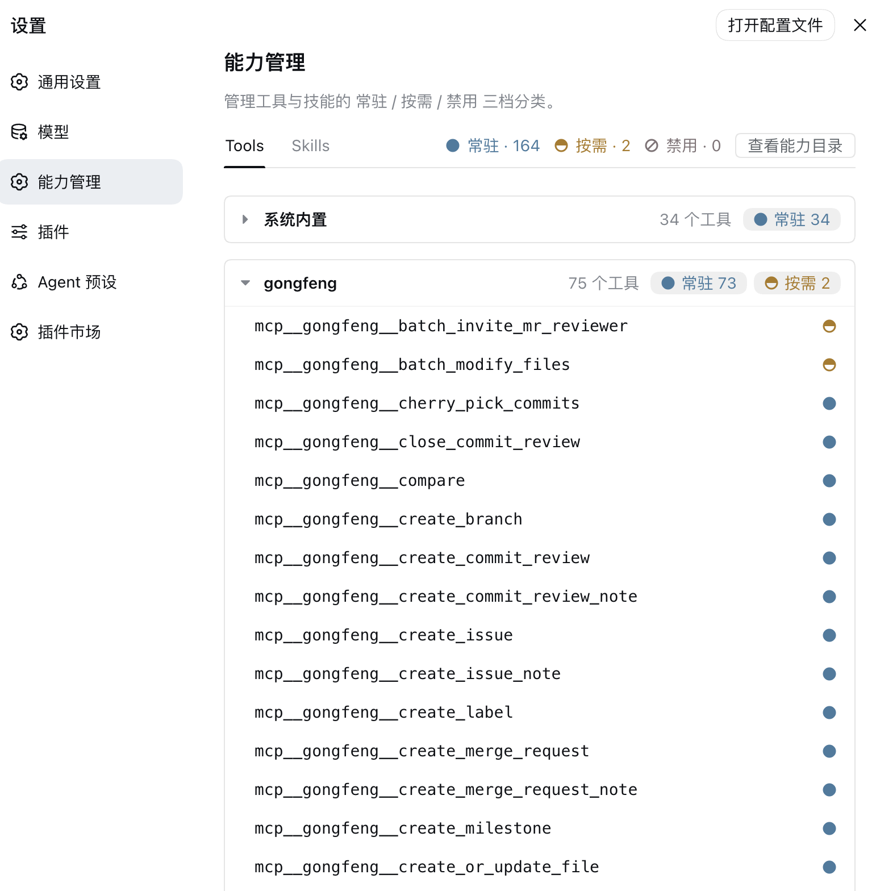
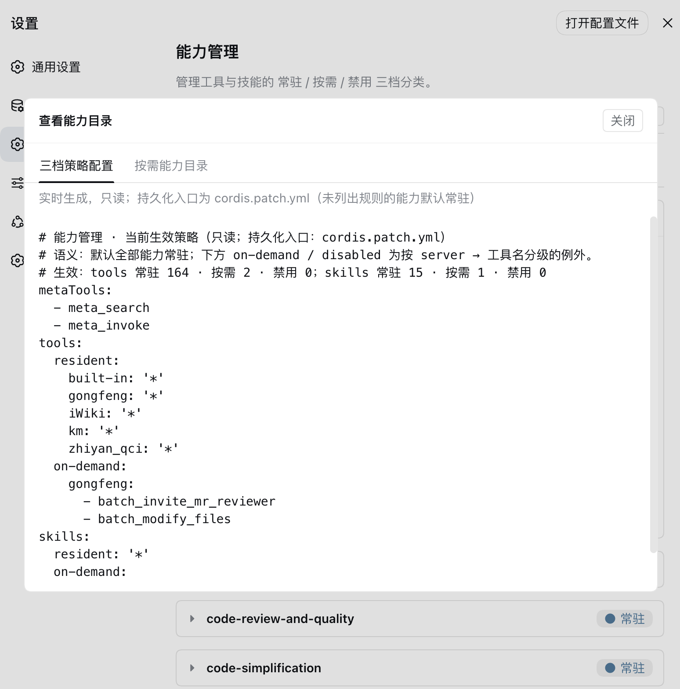
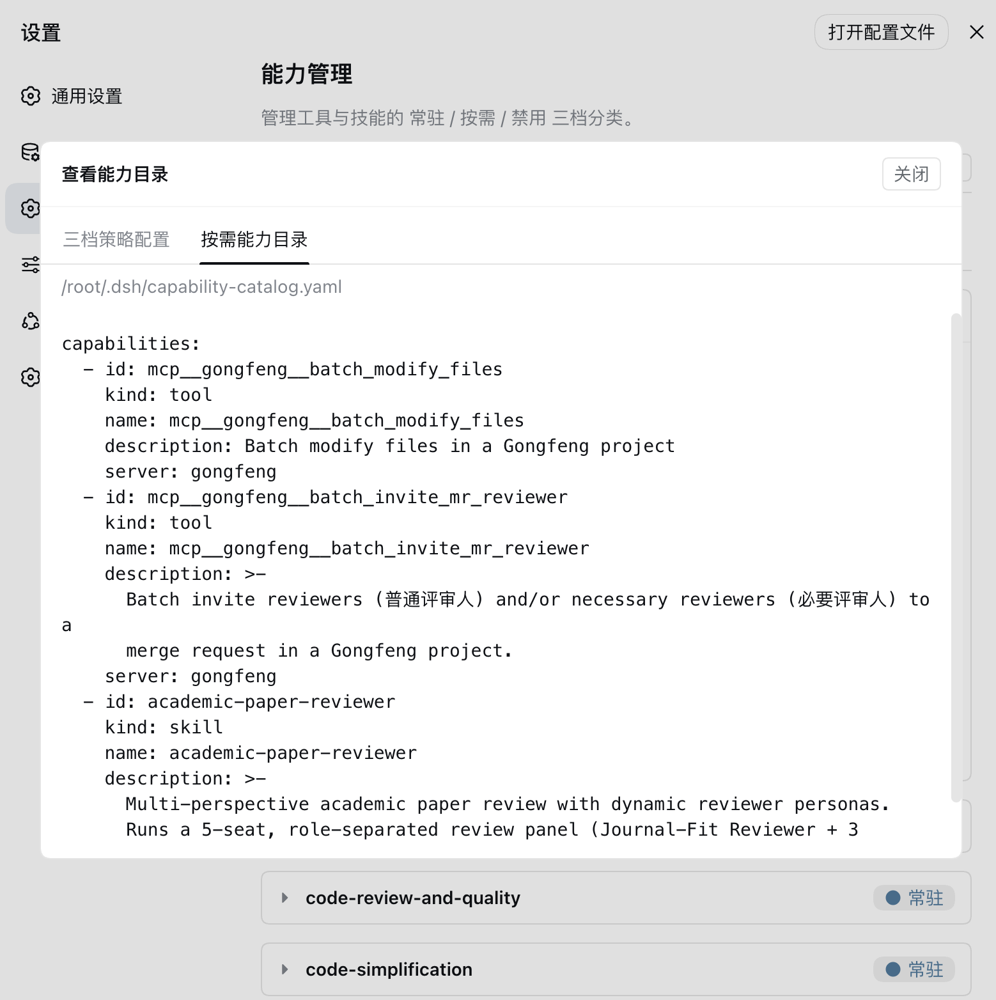

<h1 align="center">dsh-capability-menu</h1>

<p align="center">
  <strong>为 DeepSeek Harness 统一管理 Tools 和 Skills 的暴露水平（上下文占用大小）与执行方式</strong>
</p>

<p align="center">
  <a href="https://github.com/deepseek-ai/deepseek-harness"></a>
  <a href="https://www.npmjs.com/package/@daweifu/capability-menu"></a>
  <a href="https://github.com/PKUfudawei/dsh-capability-menu/actions"></a>
  <a href="https://www.npmjs.com/package/@daweifu/capability-menu"></a>
  <a href="https://github.com/PKUfudawei/dsh-capability-menu"></a>
  <a href="https://github.com/awesome-dsh-plugin/awesome-dsh-plugin"></a>
</p>

<p align="center">
  <strong>简体中文</strong> · <a href="./README.en.md">English</a>
</p>

<br/>

## 目录

- [能力总览](#能力总览)
- [快速安装](#快速安装)
- [暴露策略](#暴露策略)
- [配置文件](#配置文件)

---

## 能力总览

dsh-capability-menu 是 [DeepSeek Harness](https://github.com/deepseek-ai/deepseek-harness) 的一个 Cordis 插件，为海量 tools / skills（MCP 工具与内置原生工具）建立统一能力目录（`ctx.capability`），并以**常驻 / 按需 / 禁用**三档管理暴露程度和执行方式——随时调整 agent 的能力边界，避免海量 tools/skills 塞满一次请求、节省 token 和上下文。调整即时生效、无需重启，纯插件机制组合进 Harness 运行时，不改上游源码。**不挂载本插件（policy）时一切照旧、全量可见；挂载但未配置任何规则时，所有能力默认常驻。**

### 能力模型

Capability 是本插件引入的上位概念：Tool / Skill 是不同类型的 capability。

| kind | 对 Agent 提供 | action | 备注 |
| --- | --- | --- | --- |
| `tool` | 执行一个动作（MCP 工具或内置原生工具） | `execute` | 由 `ctx.tools` 索引 |
| `skill` | 某类任务的方法/流程/知识 | `load` | 由 `ctx.skills` 索引 |

模型获得两个元工具：

| 工具 | 作用 | 对应 entry |
| --- | --- | --- |
| `meta_search` | 检索能力目录（Tool / Skill），list/detail 双模式 | `@daweifu/capability-menu/search` |
| `meta_invoke` | 统一执行面：Tool 真执行（走完整 `ctx.tools` 管线）+ Skill 加载 | `@daweifu/capability-menu/invoke` |

### 能力菜单

<p align="center">
  
  
</p>
<p align="center">
  
  
</p>

安装后，「设置 / 通用设置」下出现「能力菜单」tab（在「模型」与「插件」之间），用来查看和调整能力的暴露档位，改动即时生效、无需重启。

| 想做什么 | 在哪 |
| --- | --- |
| 切档位 | 点能力行右侧的圆点；或点顶部的档位计数，整组切 |
| 在长列表里找能力 | 页签栏下方的过滤框，匹配名字**和所属分组**（server / 来源 / preset id），忽略大小写、可写正则（Tools / Skills 共用） |
| 注册 MCP 服务器 / Skill 目录 | 右上角「注册能力」 |
| 编辑、移除已注册项 | Tools 页 server 分组头、Skills 页技能行右侧的「编辑」 |
| 看当前生效策略与按需能力目录 | 页头说明行右侧的「策略与目录」 |
| 列表没跟上（你在 dsh 之外改过来源） | 不用管：切回本页、配置变更、carrier 重连都会自动重读，另有约 5s 的兜底轮询 |

**档位就是那个圆点**：实心 = 常驻（模型直接调用）、上半实心圆环 = 按需（走 `meta_search` → `meta_invoke`）、圆环 + 斜杠（禁行标志）= 禁用。被更高优先级规则（如通配）挡住时，界面会提示「分类未生效」。

**页面结构**：Tools 页按 server 分组、可折叠，MCP 工具挂在各自 server 下，内置原生工具统一在「系统内置」组；Skills 页分「全局技能 / 项目技能 / 预设技能」子页签——**「预设技能」只在确实存在随 agent preset 分发的技能时出现**（没有就是原来的两个页签），组内以 preset id 作小标题，不再往下分层。页签下方是过滤框：匹配名字与所属分组、支持正则（列表长时比翻分组快）。点能力行看模型侧的工具定义，点技能行展开目录树、点文件预览正文。

**三点需要知道的行为**：

- **切档位不立刻落盘**：先改内存（所以响应快），停手约 1.5s 后才写回 `patchFile`（默认 home 层的 `~/.dsh/cordis.patch.yml`）——写这个文件会让 dsh 热重载本插件，所以不能每次点击都写。
- **注册是写文件**：MCP 服务器写进同一个 patch 文件（`@deepseek-ai/dsh-mcp-client` 条目，由 dsh 原生挂载，插件不自己管连接）；Skill 在技能根下建软链。请求头等凭据**明文**存在那里。
- **有的技能行给的是「纳入管理」而不是「编辑」**：`~/.agents/skills` / `customSkillDirs` 这类用户级根里的技能，确认框会写明它当前所在的目录，确认后软链进 `~/.dsh/skills/`，**内容不动**；不能纳管的行改为显示来源。**随 agent preset 分发的技能不提供「纳入管理」**：把预设资产软链进用户技能根等于让它对所有会话生效，与该类技能"只对挂载了预设的会话可见"的定位相反，因此这类行只显示「来自预设 X」。

> **技能来源与同名规则**：技能行上的来源标签来自 dsh 的 provider（`project-dsh` / `user-agents` / `custom` / `bundled` …），而**预设技能和用户自配的 `customSkillDirs` 都是 `custom`**——两者只能靠作用域归属区分，所以分组用的是扫描时记下的 preset id，不是来源标签。档位规则按**裸名字**生效：同名技能跨作用域共享同一个开关，且索引时**全局层优先、预设之间先到先得**（与工具侧一致）；同名冲突不影响档位，但会让另一份实现不出现在列表里。

字段含义与可见范围（全局 / 项目）、移除的具体后果、注册时的 `SKILL.md` 校验口径，都在你操作的那一刻写着，这里不重复。

## 快速安装

前置：已安装 Node.js 与 dsh CLI（`dsh plugin` 内部会转发给 pnpm）。

### 从 npm 安装（推荐）

单包同时提供服务端插件与前端「能力菜单」tab，装完即可在「设置 / 通用设置」下看到。**装和升级是同一条命令**——它把 profile 里的版本指到 npm 上的最新版：

```sh
dsh plugin --profile web add "@daweifu/capability-menu@$(npm view @daweifu/capability-menu version)"
```

> **别写 `@latest`。** 实测 pnpm 12 下它会解析到旧版本（本包实测拿到 0.1.3，而 npm 上的 `latest` 已经是 0.1.4）；显式带版本号才可靠，上面的 `$(…)` 就是替你取最新版号。

### 从源码安装

```sh
git clone https://github.com/PKUfudawei/dsh-capability-menu.git
cd dsh-capability-menu
pnpm install                   # prepare 脚本自动构建 lib/（服务端）与 lib/client.js（前端）

dsh plugin --profile web add ./dsh-capability-menu
```

### 验证安装

```sh
# 已装版本（profile 目录里问 pnpm；界面本身不显示版本号）
cd "${DSH_HOME:-$HOME/.dsh}/profiles/web" && pnpm list @daweifu/capability-menu

# 挂载到的插件确实在 profile 树里
dsh --profile web --dump-config | grep -E 'capability-menu'
```

```
# == @daweifu/capability-menu
- id: capability-menu-registry
  name: '@daweifu/capability-menu/registry'
- id: capability-menu-search
  name: '@daweifu/capability-menu/search'
- id: capability-menu-invoke
  name: '@daweifu/capability-menu/invoke'
- id: capability-menu-policy
  name: '@daweifu/capability-menu/policy'
- id: capability-menu
  name: '@daweifu/capability-menu'
```

### 卸载

```sh
dsh plugin --profile web remove @daweifu/capability-menu
```

## 暴露策略

所有能力（Tool 与 Skill）按 **暴露程度**（模型在上下文中看到什么）与 **执行方式** 分为三档：

### Tools / Skills 三档暴露与执行对照

| 档位 | 能力 | 暴露方式（模型视野） | 发现 | 执行方式 |
| --- | --- | --- | --- | --- |
| **常驻** | tool | 完整 schema 进 `assembly.tools` → 模型请求 `tools` payload，每步可见 | 无需发现（已常驻） | 模型直接调用，运行时走完整 `ctx.tools` 管线 |
| | skill | 名字+描述进 `<available_skills>` 目录（正文不在目录） | 无需发现（已常驻） | `skill` 工具按需加载正文（渐进加载） |
| **按需** | tool | 不进 payload（零上下文成本） | `meta_search` list / `grep` 检索物化目录 YAML（`catalogFile`） | `meta_invoke` 执行（走 `ctx.tools.execute`，管线完整）；或 detail 拿 schema 后直接调 |
| | skill | 不进 `<available_skills>` 目录 | `meta_search` 检索 / `grep` 检索物化目录 YAML（`catalogFile`） | `meta_invoke` 加载 SKILL.md 正文（经 `ctx.skills`） |
| **禁用** | tool | 不进 payload | `meta_search` 不返回、目录 YAML 不写入 | `meta_invoke` 拒绝；模型幻觉直调也在 `tools/pre-execute` 被硬拒绝 |
| | skill | 不进 `<available_skills>` 目录 | `meta_search` 不返回、目录 YAML 不写入 | `meta_invoke` 拒绝；`skill` 工具在 `tools/pre-execute` 硬拒绝 |

> **覆盖与保留**：
> - `tool` 档同时覆盖 `mcp__` 编目工具与内置原生工具——原生工具统一以保留的 `built-in` server 归组，与 MCP 工具一样三档可管。**请勿把真实 MCP server 命名为 `built-in`。**
> - `meta_search`/`meta_invoke` 是本插件的控制面：恒常驻、不可被禁用（在规则里禁用它们会在启动时报错）。`run_code` 是 Code Mode 保留传输层：不进目录、不在「能力菜单」出现，请勿为它配置三档规则。
> - **不建议把高频核心工具设为按需**：按需的内置工具会退出模型常驻视野，使用时需要 `meta_search` → `meta_invoke` 两跳调用。

## 配置文件

规则写在本插件 entry（`capability-menu-policy`）的 `config` 下，默认落在 home 层的 `~/.dsh/cordis.patch.yml`（`$DSH_HOME` 优先），也可以由任一 profile 的 `cordis.patch.yml` 用一条按 id 定位的覆盖补丁改写（外层 `- insert:` / `id` / `name` 是 Cordis patch 的挂载样板，与规则无关）。**手写和「能力菜单」里点选都可以**：点选只改内存（所以响应快），停手约 1.5s 后再自动写回这个 entry——因为写这个文件会让 dsh 热重载本插件并重跑一次能力枚举，所以不能每次点击都写。

```yaml
config:
  tools:
    resident:
      - execute_cmd
      - get_session_context
      - search_kb
      - 'mcp__gongfeng__*'    # 通配：该 server 下全部常驻
    on-demand:
      - 'mcp__*'              # 通配兜底
      - 'server:km:*'         # 按 server 前缀批量按需
    disabled:
      - 'mcp__secret__*'      # 禁用优先级最高，压过常驻
  skills:
    resident:
      - debugging
      - coding
    on-demand:
      - legacy_skill          # 显式按需（未列出即默认常驻）
    disabled:
      - forbidden_skill
  metaTools:
    - meta_search             # 恒常驻，不可被禁用
    - meta_invoke
```

> 配置键即档位英文词：`resident`（常驻）/ `on-demand`（按需）/ `disabled`（禁用）。

### 全部配置项

| 配置项 | 归属 entry | 默认值 | 说明 |
| --- | --- | --- | --- |
| `tools` / `skills` / `metaTools` | `capability-menu-policy` | 见上 | 三档分类规则；能力菜单的改动会（防抖后）自动写回本 entry 的 `config` |
| `catalogFile` | `capability-menu-registry` | `~/.dsh/capability-catalog.yaml` | 按需能力目录物化路径，置空禁用 |
| `refreshDebounceMs` | `capability-menu-registry` | `200` | 变更事件的重建防抖窗口（ms）；`0` 关闭防抖 |
| `patchFile` | `capability-menu-policy` | `~/.dsh/cordis.patch.yml`（`$DSH_HOME` 优先） | 注册 MCP 服务器写入的 patch 文件 |
| `skillsDir` | `capability-menu-policy` | `~/.dsh/skills` | 注册 Skill 目录的技能根 |
| `persistDebounceMs` | `capability-menu-policy` | `1500` | 点选改动写回 patch 文件前的防抖窗口（ms）|

**规则优先级**（从上到下命中即停；同档内精确规则优先于通配）：

| 优先级 | 规则 | 示例 | 效果 |
| --- | --- | --- | --- |
| 1 | `disabled` 精确 | `disabled: [forbidden_skill]` | 最硬禁用，压过一切 |
| 2 | `disabled` 通配 | `disabled: ['mcp__secret__*']` | 整组禁用 |
| 3 | `resident` 精确 | `resident: [bash]` | 单个能力显式常驻 |
| 4 | `on-demand` 精确 | `on-demand: [legacy_skill]` | 单个能力显式按需（能力菜单点击写入的就是这类） |
| 5 | `resident` 通配 | `resident: ['mcp__gongfeng__*']` | 整组常驻 |
| 6 | `on-demand` 通配 | `on-demand: ['mcp__*']` | 兜底批量按需 |
| 默认 | 未命中任何规则 | — | 常驻 |

要点：
- **精确规则优先于通配（跨档也成立）**：例如存在 `resident: ['mcp__gongfeng__*']` 时，在「能力菜单」把某工具点成按需会写入一条精确 `on-demand` 规则并生效，不会被通配压回；若仍被更高优先级规则覆盖，界面提示「分类未生效」。

> **两类改动，落盘位置不同**：
>
> - **三档分类**先只改内存（所以点击即时生效），停手约 1.5s 后自动写回本插件 entry 的 `config`（`patchFile`，默认 home 层的 `~/.dsh/cordis.patch.yml`）——写这个文件会让 dsh 热重载本插件并重跑一次能力枚举，所以不能每次点击都写。要在版本管理里批量声明规则，直接编辑同一条 entry 即可，无需额外的导入/导出按钮。
> - **注册的来源**（MCP 服务器、Skill 目录）在点击当下就落盘：MCP 写进同一个 patch 文件（`@deepseek-ai/dsh-mcp-client` 条目），Skill 在技能根下建软链。

### 按需能力目录（`catalogFile`，唯一物化目录，grep 可检索）

On-demand 能力自动物化成**一个 YAML 文件**给模型检索（改档位只重写这个文件——库存没变，不需要重新枚举工具与各 agent preset 的技能层）：

- 文件位置在 **registry entry（`capability-menu-registry`）** 的 `config.catalogFile`，默认 `~/.dsh/capability-catalog.yaml`，置空禁用；工具/技能变更或分类调整后自动重写。没有任何按需能力时不注入目录指引，省上下文。
- 技能必须**已注册进 `ctx.skills`**（SKILL.md 放用户/项目技能根或挂 `customSkillDirs`）才会自动出现；无独立手写输入清单。
- 模型用 `grep`/`read` 浏览该文件（或调 `meta_search`）拿到条目的 id 与 `kind`，再调 `meta_invoke(id, kind)` 执行/加载。技能 id 即裸名（`frontend-design`），tool/skill 由 `kind` 区分。

```yaml
# ~/.dsh/capability-catalog.yaml（自动生成；仅含 On-demand 能力，
# Resident 已常驻、Disabled 不可发现，均不写入；列表以 `-` 每项一行的 block 序列写出）
capabilities:
  - id: mcp__km__search
    kind: tool
    name: mcp__km__search
    description: 搜索知识库
    server: km
  - id: legacy_skill
    kind: skill
    name: legacy_skill
    description: 处理旧工程的低频技能
    whenToUse: 处理旧工程时使用
```

> 目录文件默认写在宿主 `~/.dsh`，需要模型侧 `bash`/`read` 工具的沙箱能访问该路径；若沙箱隔离宿主目录，请把 `catalogFile` 显式配置到沙箱可见的路径。默认路径在多个 dsh 实例间共享（last-write-wins），多实例部署时请为每个实例配置独立的 `catalogFile`。

## License

本项目遵循 [Apache License 2.0](LICENSE)。
