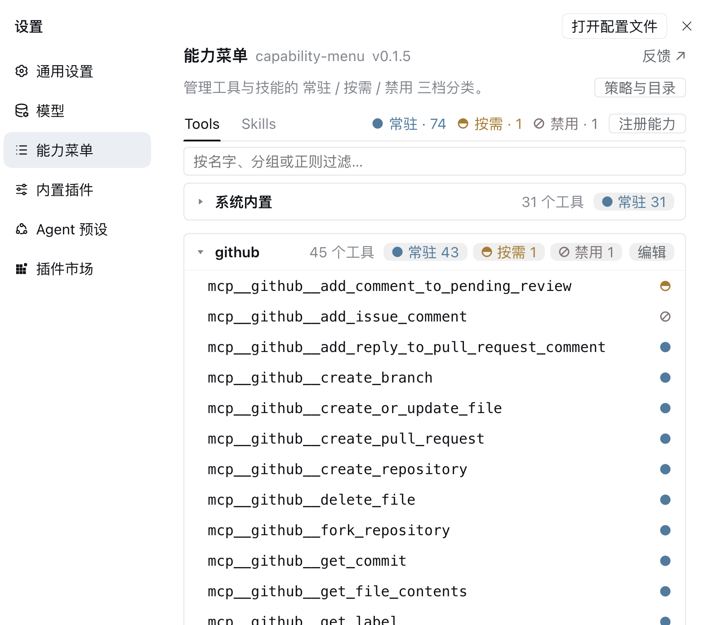
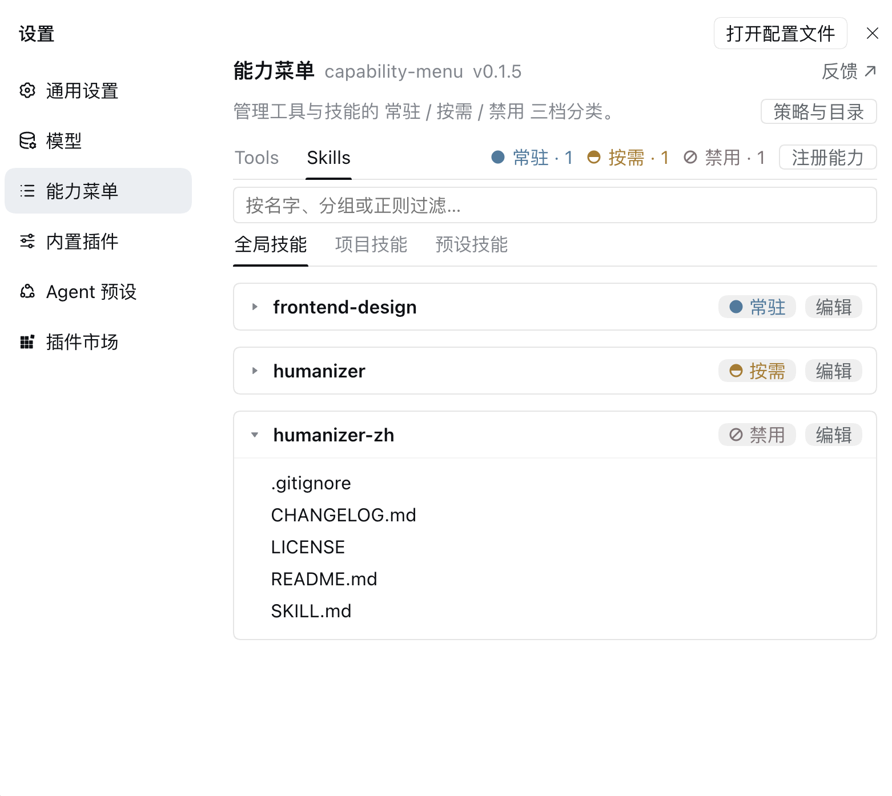

<h1 align="center">dsh-capability-menu</h1>

<p align="center">
  <strong>统一管理 DeepSeek Harness 中 Tools 与 Skills 的暴露策略和调用方式，按需发现与调用，减少上下文占用</strong>
</p>

<p align="center">
  <a href="https://github.com/deepseek-ai/deepseek-harness"></a>
  <a href="https://www.npmjs.com/package/@daweifu/capability-menu"></a>
  <a href="https://github.com/PKUfudawei/dsh-capability-menu/actions"></a>
  <a href="https://www.npmjs.com/package/@daweifu/capability-menu"></a>
  <a href="https://github.com/PKUfudawei/dsh-capability-menu"></a>
  <a href="https://github.com/awesome-dsh-plugin/awesome-dsh-plugin"></a>
</p>

<p align="center">
  <strong>简体中文</strong> · <a href="./README.en.md">English</a>
</p>

## 目录

- [能力总览](#能力总览)
  - [能力模型](#能力模型)
  - [能力菜单](#能力菜单)
- [安装与卸载](#安装与卸载)
  - [从 npm 安装（推荐）](#从-npm-安装推荐)
  - [从源码安装](#从源码安装)
  - [验证安装](#验证安装)
  - [卸载](#卸载)
- [暴露策略](#暴露策略)
  - [Tools 和 Skills 三档暴露与执行对照](#tools-和-skills-三档暴露与执行对照)
- [配置](#配置)
  - [全部配置项](#全部配置项)
  - [按需能力目录（`catalogfile`）](#按需能力目录catalogfile)

---

## 能力总览

- 为 DeepSeek Harness 的 tools（包括 MCP 工具和内置工具）与 skills 建立统一能力目录：`ctx.capability`。
- 提供**常驻 / 按需 / 禁用**三档策略，管理能力的暴露与调用。
- 按需能力只在需要时提供给 Agent，减少单次请求携带的工具定义，节省 token 和上下文。

### 能力模型

Capability 是本插件引入的上位概念：Tool / Skill 是不同类型的 capability。

| kind | 对 Agent 提供 | action | 备注 |
| --- | --- | --- | --- |
| `tool` | 执行一个动作（MCP 工具或内置原生工具） | `execute` | 由 `ctx.tools` 索引 |
| `skill` | 某类任务的方法/流程/知识 | `load` | 由 `ctx.skills` 索引 |

模型获得两个元工具：

| 工具 | 作用 | 对应 entry |
| --- | --- | --- |
| `meta_search` | 搜索 Tool / Skill 候选项；列表摘要用于筛选，详情返回指定能力的完整说明及工具参数 schema / Skill 使用提示 | `@daweifu/capability-menu/search` |
| `meta_invoke` | 统一执行面：Tool 真执行（走完整 `ctx.tools` 管线）+ Skill 加载 | `@daweifu/capability-menu/invoke` |

### 能力菜单

<p align="center">
  
  
</p>
安装后，在「设置」导航中选择「能力菜单」，即可管理 Tools 和 Skills。

| 操作 | 用法 |
| --- | --- |
| 更改档位 | 点击能力旁的圆点；也可以点击顶部档位计数，批量切换该组能力 |
| 查找能力 | 使用页签下方的过滤框搜索名称或分组；支持正则表达式，不区分大小写 |
| 查看能力详情 | 点击 Tool 查看定义；点击 Skill 展开文件列表并预览文件，内容按 Markdown 渲染 |
| 注册能力 | 点击右上角「注册能力」，添加 MCP 服务器或 Skill 目录；Skill 支持本机目录或公开 GitHub 链接 |
| 编辑或移除 | 在 Tools 的服务器分组或 Skills 的技能项中点击「编辑」 |
| 查看策略和目录 | 点击页头右侧的「策略与目录」 |

注册 MCP 会写入 patch 配置；文件或父目录缺失时会自动创建。MCP 请求头等凭据保存在配置中，请妥善保管。注册 Skill 则会在所选技能根目录创建链接或导入目录。

GitHub Skill 支持默认分支根目录链接（需含 `SKILL.md`）、指定分支根目录 `https://github.com/{owner}/{repo}/tree/{branch}`，以及指定分支下的技能目录 `https://github.com/{owner}/{repo}/tree/{branch}/{skill-directory}`。也可输入本机目录。仅支持公开仓库；导入需要运行 dsh 的机器安装 Git，插件会校验 `SKILL.md` 并只复制所选目录。

## 安装与卸载

前置：[Node.js](https://nodejs.org/en/download) 与 [dsh CLI](https://github.com/deepseek-ai/deepseek-harness)；支持 DeepSeek Harness `0.1.5-rc.2` 和 `0.2.0-rc.1`（`dsh plugin` 内部会转发给 pnpm，不用单独装 pnpm）。

### 从 npm 安装（推荐）

单包同时提供服务端插件与前端「能力菜单」页面，安装后会作为「设置」中的独立栏目显示：

```sh
# 安装
dsh plugin --profile web add @daweifu/capability-menu

# 升级到 npm 的 latest 标签指向的版本（要显式带版本号，避免沿用已安装版本）
dsh plugin --profile web add "@daweifu/capability-menu@$(npm view @daweifu/capability-menu dist-tags.latest)"

# 若要安装 next 等预发布标签，请把 latest 换成对应标签名，例如：
# dsh plugin --profile web add "@daweifu/capability-menu@$(npm view @daweifu/capability-menu dist-tags.next)"
```

升级命令安装 npm `latest` 标签指向的版本；安装预发布版本请使用对应标签或指定版本号。

### 从源码安装

```sh
git clone https://github.com/PKUfudawei/dsh-capability-menu.git
cd dsh-capability-menu
pnpm install                   # prepare 脚本自动构建 lib/（服务端）与 lib/client.js（前端）

dsh plugin --profile web add ./dsh-capability-menu
```

### 验证安装

```sh
cd "${DSH_HOME:-$HOME/.dsh}/profiles/web" && pnpm list @daweifu/capability-menu && dsh --profile web --dump-config | grep -m1 '== @daweifu/capability-menu'
```

### 卸载

```sh
dsh plugin --profile web remove @daweifu/capability-menu
```

## 暴露策略

所有能力（Tool 与 Skill）按 **暴露程度**（模型在上下文中看到什么）与 **执行方式** 分为三档：

### Tools 和 Skills 三档暴露与执行对照

| 档位 | 能力 | 模型能看到什么 | 如何找到 | 如何使用 |
| --- | --- | --- | --- | --- |
| **常驻** | tool | 工具定义始终随请求提供 | 无需查找 | 直接调用；运行时经过完整 `ctx.tools` 管线 |
| | skill | 名称和简介显示在 `<available_skills>` 中 | 无需查找 | `skill` 工具按需加载正文 |
| **按需** | tool | 不随请求提供工具定义 | 用 `meta_search` 搜索候选项，或搜索能力目录 YAML（`catalogFile`） | 用 `meta_invoke` 调用；也可先按精确 id 查看详情和参数，再直接调用 |
| | skill | 不显示在 `<available_skills>` 中 | 用 `meta_search` 搜索，或搜索能力目录 YAML（`catalogFile`） | 用 `meta_invoke` 加载 `SKILL.md` |
| **禁用** | tool | 不随请求提供工具定义 | 搜索结果和能力目录中均不可见 | 调用会被拒绝 |
| | skill | 不显示在 `<available_skills>` 中 | 搜索结果和能力目录中均不可见 | 加载会被拒绝 |

> **覆盖与保留**：
> - 三档策略同时覆盖 MCP 与内置原生工具；内置工具归入保留组 `built-in`。**请勿把 MCP server 命名为 `built-in`。**
> - `meta_search` 和 `meta_invoke` 固定常驻且不可禁用。`run_code` 是 Code Mode 保留工具，不进目录或菜单，也无需配置档位。
> - **高频核心工具建议设为常驻**：按需内置工具需经 `meta_search` → `meta_invoke` 两步调用。

## 配置

规则写在本插件 `capability-menu-policy` entry 的 `config` 下：

- 默认文件是 `~/.dsh/cordis.patch.yml`；设置了 `$DSH_HOME` 时使用 `$DSH_HOME/cordis.patch.yml`。
- 可手写 YAML，也可在「能力菜单」里点选。点选立即更新内存，停手约 1.5 秒后统一写回，避免频繁热重载和能力重建。
- Profile 可在自己的 `cordis.patch.yml` 中按 entry ID 覆盖规则。示例中的 `- insert:`、`id`、`name` 属于 Cordis 补丁结构，不是策略字段。

```yaml
config:
  tools:
    resident: # 常驻
      - execute_cmd
      - get_session_context
      - search_kb
      - 'mcp__gongfeng__*'    # 通配：该 server 下全部常驻
    on-demand: # 按需
      - 'mcp__*'              # 通配兜底
      - 'server:km:*'         # 按 server 前缀批量按需
    disabled: # 禁用
      - 'mcp__secret__*'      # 禁用优先级最高，压过常驻
  skills:
    resident: # 常驻
      - debugging
      - coding
    on-demand: # 按需
      - legacy_skill          # 显式按需（未列出即默认常驻）
    disabled: # 禁用
      - forbidden_skill
  metaTools:
    - meta_search             # 恒常驻，不可被禁用
    - meta_invoke
```

### 全部配置项

| 配置项 | 归属 entry | 默认值 | 说明 |
| --- | --- | --- | --- |
| `tools` / `skills` / `metaTools` | `capability-menu-policy` | 见上 | 三档分类规则；能力菜单的改动会（防抖后）自动写回本 entry 的 `config` |
| `catalogFile` | `capability-menu-registry` | `~/.dsh/capability-catalog.yaml` | 按需能力目录物化路径，置空禁用 |
| `refreshDebounceMs` | `capability-menu-registry` | `200` | 变更事件的重建防抖窗口（ms）；`0` 关闭防抖 |
| `patchFile` | `capability-menu-policy` | `~/.dsh/cordis.patch.yml`（`$DSH_HOME` 优先） | 注册 MCP 服务器写入的 patch 文件 |
| `skillsDir` | `capability-menu-policy` | `~/.dsh/skills` | 注册 Skill 目录的技能根 |
| `persistDebounceMs` | `capability-menu-policy` | `1500` | 点选改动写回 patch 文件前的防抖窗口（ms）|

这些配置项分别属于对应的插件 entry，通常都写在同一份 `cordis.patch.yml` 里，不需要为每项单独建配置文件。`catalogFile` 是插件自动生成、供模型检索的目录文件；`skillsDir` 是 Skill 存放目录。

**规则优先级**（按序匹配：禁用始终优先；在常驻与按需之间，精确规则优先于通配）：

| 优先级 | 规则 | 示例 | 效果 |
| --- | --- | --- | --- |
| 1 | `disabled` 精确 | `disabled: [forbidden_skill]` | 最硬禁用，压过一切 |
| 2 | `disabled` 通配 | `disabled: ['mcp__secret__*']` | 整组禁用 |
| 3 | `resident` 精确 | `resident: [bash]` | 单个能力显式常驻 |
| 4 | `on-demand` 精确 | `on-demand: [legacy_skill]` | 单个能力显式按需（能力菜单点击写入的就是这类） |
| 5 | `resident` 通配 | `resident: ['mcp__gongfeng__*']` | 整组常驻 |
| 6 | `on-demand` 通配 | `on-demand: ['mcp__*']` | 兜底批量按需 |
| 默认 | 未命中任何规则 | — | 常驻 |

若更高优先级规则覆盖了所选档位，界面会提示「分类未生效」。

### 按需能力目录（`catalogFile`）

插件会把按需 Tool 和 Skill 写入 `catalogFile` 指定的 YAML 文件，供模型检索。默认路径为 `~/.dsh/capability-catalog.yaml`，设为空字符串可关闭；没有按需能力时，模型不会收到目录提示。目录会在 Tool、Skill 或档位变化后自动更新。

Skill 需要先注册到 `ctx.skills` 才会出现在目录中。模型可以用 `grep` / `read` 搜索目录，或调用 `meta_search` 查找条目，再通过 `meta_invoke` 使用对应能力。每个条目包含 `id` 和 `kind`，Skill 的 id 使用其名称。

```yaml
# ~/.dsh/capability-catalog.yaml（自动生成；仅含 On-demand 能力，
# Resident 已常驻、Disabled 不可发现，均不写入；列表以 `-` 每项一行的 block 序列写出）
capabilities:
  - id: mcp__km__search
    kind: tool
    name: mcp__km__search
    description: 搜索知识库
    server: km
  - id: legacy_skill
    kind: skill
    name: legacy_skill
    description: 处理旧工程的低频技能
    whenToUse: 处理旧工程时使用
```

如果模型侧的 `bash` / `read` 沙箱无法访问默认目录，请把 `catalogFile` 改到沙箱可见的位置。多个 DSH 实例默认共用该文件；需要隔离时，为每个实例设置不同路径。

## License

本项目遵循 [Apache License 2.0](LICENSE)。
